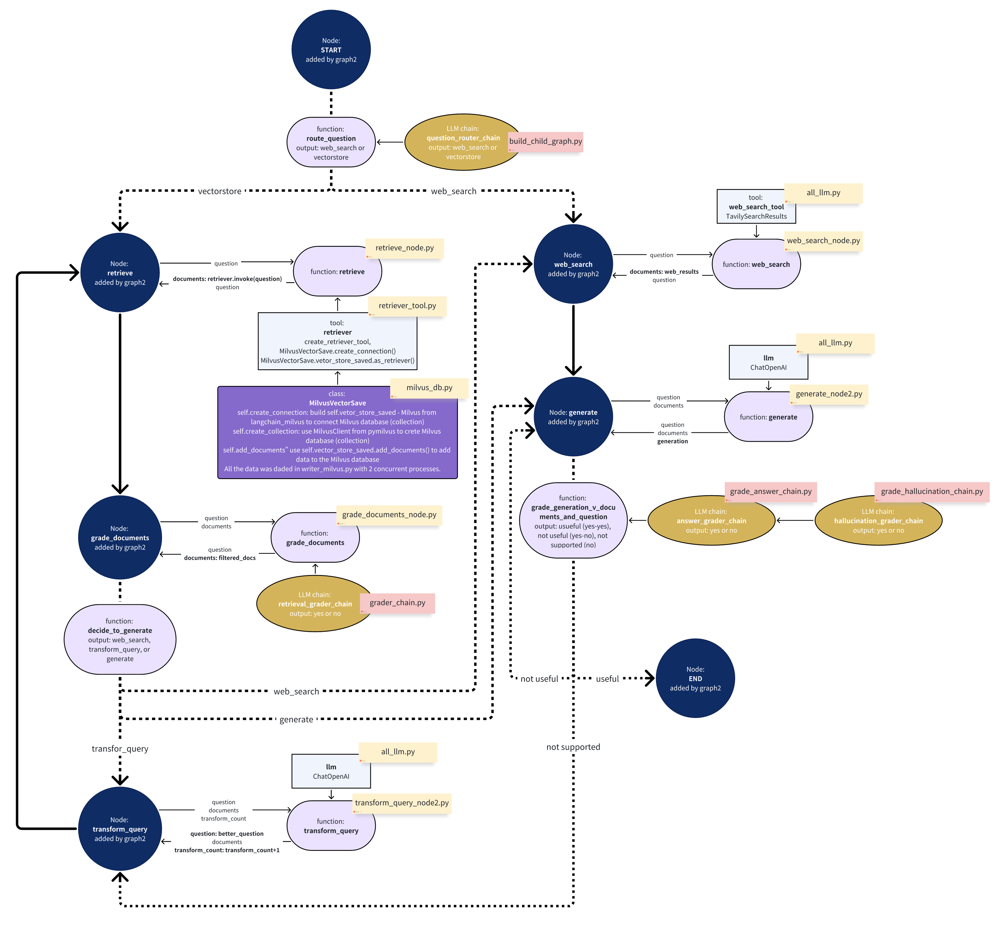

# 🚀 RAG Practice Repository  

## 📌 Overview  
This repository contains hands-on exercises in **Retrieval-Augmented Generation (RAG)**, focusing on key skills relevant as of **June 2025**, including:  
- **Building a Milvus database** for efficient retrieval  
- **Loading and processing various file formats** (HTML, Markdown, PDF, Excel, Word, etc.)  
- **Data chunking and embedding** using **sparse (BM25)** and **dense (bge) vector methods**  
- **Retrieving data** with **Approximate Nearest Neighbor (ANN), full-text search, and hybrid search**  
- **Understanding and implementing Agent-RAG**  
- **Developing RAG agents** for a Chinese semiconductor company :  
  - **Corrective RAG agent** (`graph1.py`)  
  - **Adaptive RAG agent** (`graph2.py`)  

---

## 🗂 Repository Structure  

### 🔹 **Demo**  
- `demo`: Connects to **local Milvus Lite** for basic database operations  
- `demo1`: Connects to **Milvus Standalone** on a **server (local machine)** for database operations  

### 🔹 **Data Loading (`./text-load`)**  
- `demo1.py`: Parses PDFs using **PyPDFLoader**  
- `demo2.py`: Parses PDFs using **LangChain Unstructured**, outputting JSONs  
- `demo3.py`: Defines a function to **recover content** from a generated JSON file  
- `demo4.py`: Loads Markdown files with **LangChain Unstructured**  

### 🔹 **Document Processing (`./documents`)**  
- `markdown_parser.py`: Defines a **chunking and loading class** for Markdown, merging paragraphs and handling long content  
- `milvus_db.py`: Implements a class to **create collections and indexes** for **dense and sparse vectors**  
- `write_milvus.py`: Defines **parallel processing functions** to parse Markdown and store data in **Milvus**  

### 🔹 **Embedding Practice (`./test_vector`)**  
- `demo1.py`: Tests **dense embedding** with **bge**  
- `demo2.py`: Tests **sparse embedding** with **BM25 indexing**  

### 🔹 **Search Techniques (`./search_tool`)**  
- `test_search.py`: Explores different retrieval methods using **PyMilvus** and **LangChain-Milvus**:  
  - **ANN (dense vector)**  
  - **Full-text search (sparse vector)**  
  - **Hybrid search**   

### 🔹 **Tools (`./tools`)**  
- `retriever_tools.py`: Encapsulates **hybrid search** with **LangChain-Milvus** into a **retriever tool**  

### 🔹 **Agents (`./agent`)**  
- `rag_agent`: Experiments with **LangChain agent** using the retriever tool  

### 🔹 **Corrective RAG Agents (`./graph`)**  
- `graph1`: Implements a **Corrective RAG agent** with chat memory
---

## 🎯 Capstone Project: **Adaptive RAG Agent (`./graph2`)** 
The project showcases an **Adaptive RAG agent**, dynamically adjusting its response based on **retrieved documents and web search results**.  

This approach enhances accuracy and relevance in information retrieval for a Chinese semiconductor company.
- `graph2`: Implements an **Adaptive RAG agent**, balancing **web search** and **RAG query results** for optimal answers  

**Flowchart:**  
      
  

🚀 **Start exploring the repository!** Let me know if you’d like further refinements. 🔥  